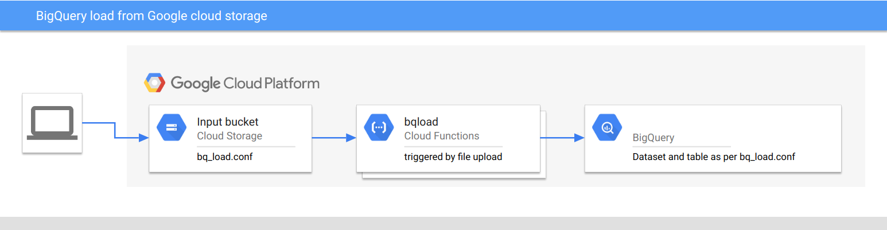

# BQ Load
Google cloud function to load data from GCS into BigQuery.

A data file uploaded into your '[BUCKET]' triggers the cloud function which creates a BQ load job for to load the data into the desired BQ dataset and table. The format of the data file, BQ dataset and table are secified in a file named bq_load.conf which must reside in the same path the data files are uploaded to, for more details see the section "Config File" below.  



## Installation
Use the provided Terraform script `bqload.tf`

### Deploying

To deploy the fuction and associated resources apply the provided terraform script bqload.tf.

If you need specific users to access the BQ dataset/table you can specify a list of user emails using the bq_users input variable.
```
terraform apply -var="bq_users=[\"my_user@google.com\"]"
```

## Usage


### Config file

The parameters of the load job are defined in a config file residing in the same path as the files to be ingested are uploaded. The default filename of the load config file is bq_load.conf.

Note: The bucket is created with a lifecycle policy which deletes all objects older than 1 day. To avoid deleting any bq_load.conf files, Place a [temporary hold](https://cloud.google.com/storage/docs/holding-objects#place-object-hold) on each bq_load.conf object in your buckect so that these are not deleted by the bucket's lifecycle policy. 

The syntax of the load config file is:
```
[load]
DataSet = <name_of_BQ_dataset> 
Table = <name_of_BQ_table>
HashCheck = {md5}
Format = [CSV|JSON]
```

## Making changes to the function

If you want to make changes the source coud of the bqload function you must redeploy it for these changes to be effective. To deploy a new bqload function follow the following steps:

1. zip the files in the function directory into a file named bqload.zip. Example: 
```
cd functions && zip bqload.zip *
```
2. Mark the function as changed by tainting the terraform resouce.
```
terraform taint google_cloudfunctions_function.new-books
```
3. Apply the terraform scrip to redeploy the function
```
terraform apply
```
